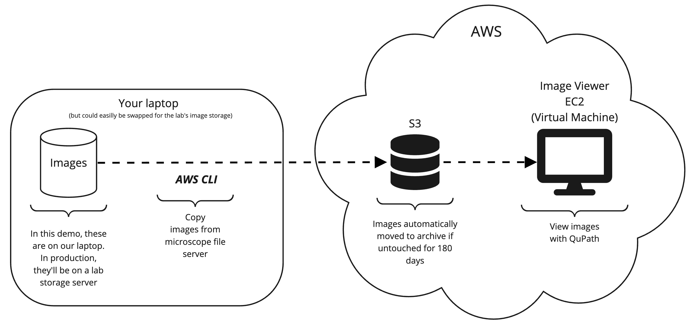
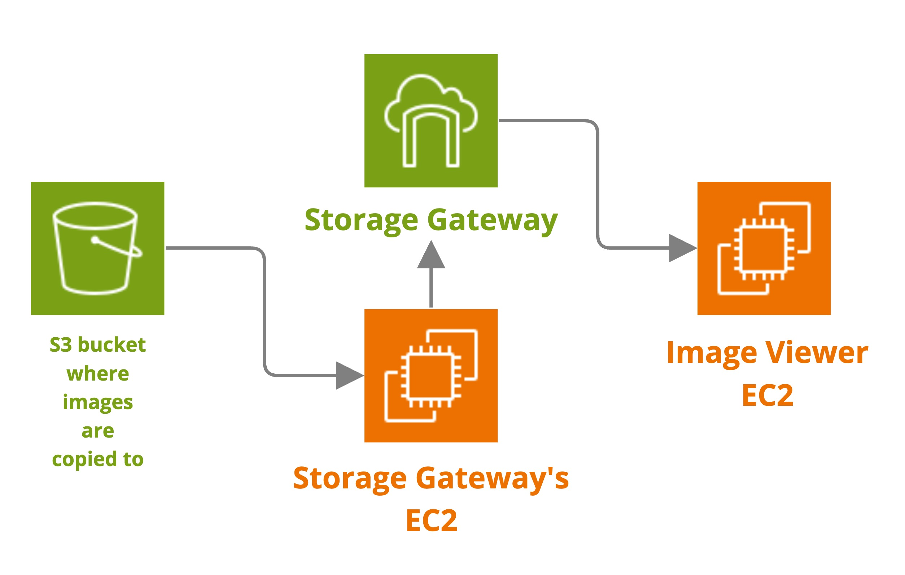
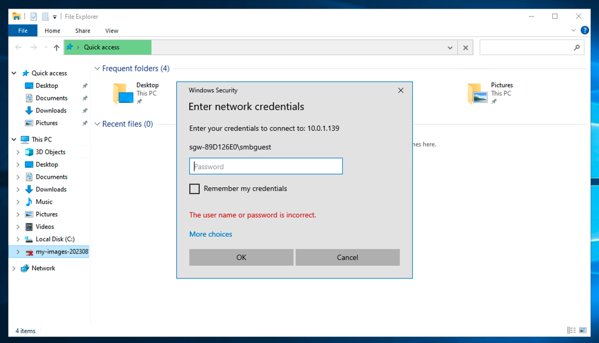
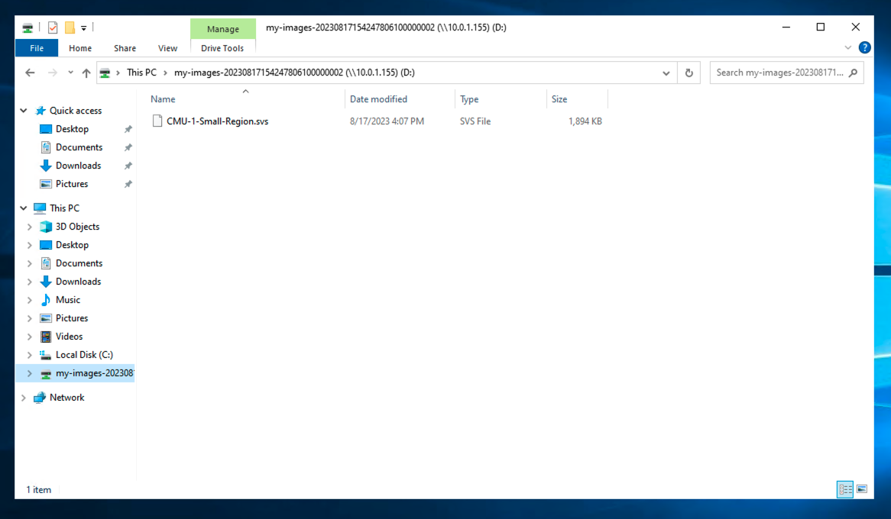
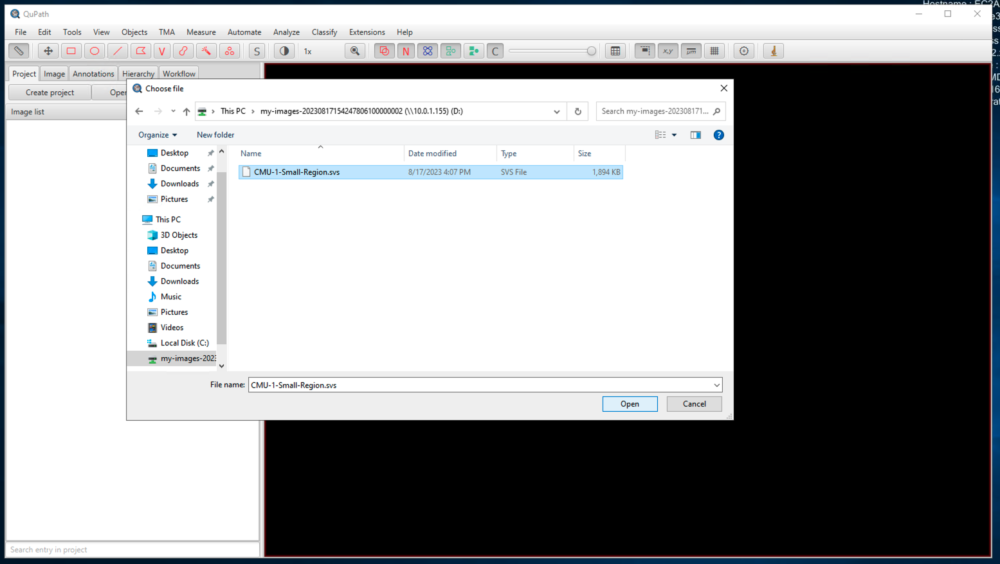
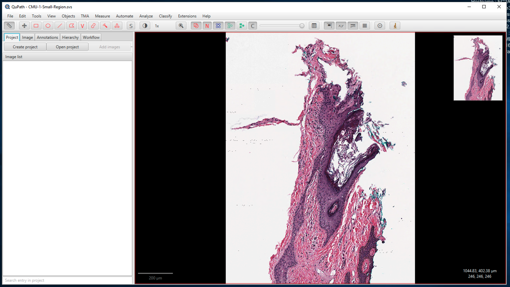

# Lightweight Imaging Platform
The Lightweight Imaging Platform is a demonstration stack providing you with the capability to:
* Automatically copy images from your lab to AWS S3 (in the instructions below, we'll simulate the lab's image storage with your laptop)
* Automatically archive images that have not been touched for 180 days
* Enabled non-cloud-native desktop applications to open images from AWS S3
* View and analyse images, using your tool of choice, from anywhere in the world

This repository contains Terraform code that will install the necessary components to perform the above tasks 

##  Disclaimer
This is a demonstration application only! The security is wide open, and you should take steps to tighten it should you
wish to use it in a production system. In particular, at least the following changes should be made:
1. IP address ranges (CIDR blocks) should be restricted in the private NAT gateway.
2. CIDR blocks should be restricted in the security groups.
3. IAM policies should be restricted.
4. The username and password attached to the Storage Gateway must be changed.

If you wish this to be networked with your lab (which is kinda the point), you should move the EC2 to a private subnet. 

## Overview
Once installed, you will have the ability to do the following



Terraform will install the following architecture into your AWS account



It will also install ancillary services, such as IAM roles & policies (permissions stuff) and supportive services for 
Storage Gateway. Storage Gateway, at a high-level, presents S3 as a file system, which means desktop applications installed 
on an EC2 can open files stored in S3. 

In more detail, the flow is this:
1. An analysis tool, such as QuPath, is installed on the Image Viewer EC2
1. The AWS CLI is used to copy images to S3 (in production you can replace this with the AWS CLI wrapped in a Windows 
service or use an off-the-shelf tool like Syncback pro)
1. Storage Gateway uses its own EC2 to load objects from S3 and presents them as if they were files to the Image Viewer EC2
1. QuPath opens the objects in S3 as if it was a file.
1. The S3 bucket is configured with Intelligent Tiering, which means that after 125 days (configurable in the terraform 
code) objects are moved to Glacial storage and after 180 days are moved to deep Glacial.

## Installing the components to AWS
### AWS environment
This assumes you already have an AWS account. If not, go ahead and create one. You will also need to have Terraform 
installed on your local machine.

To run the terraform scripts, you need to have AWS keys. You will need to create an IAM user in your AWS account and have 
the user's access keys saved to your ~/.aws/credentials file (see [here](https://docs.aws.amazon.com/powershell/latest/userguide/pstools-appendix-sign-up.html)
for instructions on creating and IAM User & their access keys):
```
[default]
AWS_ACCESS_KEY_ID=...
AWS_SECRET_ACCESS_KEY=...
```

### EC2 Key Pairs
You will need to create an EC2 Key Pair, so that you can connect to the EC2. Follow 
[these](https://docs.aws.amazon.com/AWSEC2/latest/UserGuide/create-key-pairs.html) instructions. Don't forget to download 
the resultant pem file.

### Install using terraform
1. Initialise terraform: `terraform init`
1. Set your AWS Profile, so that Terraform can authenticate against AWS: `export AWS_PROFILE=default`
1. Install the AWS components: `terraform apply -var "keyPair=[name of key pair created above]"
1. The output will indicate the IP address required to be entered into your Remote Desktop client for the QuPath EC2 and
will also contain the S3 bucket name for you to copy your images into. 
```shell
qupath_ec2_ip = "QuPath EC2 IP (put this into your Remote Desktop client, see README for username & password) = 34.242.152.175"
s3_bucket_name = "The S3 bucket name (to push your images into, see README for how) = my-images-20230817161916883800000002"

```

### Uninstalling
1. Set your AWS Profile, so that Terraform can authenticate against AWS: `export AWS_PROFILE=default`
1. `terraform destroy -var "keyPair=[name of key pair created above]"`

## QuPath EC2 Setup
### Accessing the EC2
1. In the AWS console, select the EC2, select the **Actions** menu, **Security**, **Get Windows Password** and upload the Key Pair
created above.
1. Select the EC2 again and press **Connect**. Use the username **Administrator** and password in the previous step to 
remote-desktop into the EC2.

### Mounting the S3 bucket as a file share in the EC2
1. The S3 bucket is automatically mounted as a network drive at **my-images-\[timestamp\]**. Open an Explorer window and 
click the mounted drive. 
1. When you are asked for a password, enter "password" (_note, you must change this password if you want to productionise_)



### Install QuPath
Once you've accessed the EC2, open a web browser and download QuPath. The link can be found [here](https://qupath.github.io/)

### Install the AWS CLI
Follow the instructions [here](https://docs.aws.amazon.com/cli/latest/userguide/getting-started-install.html) to install
the AWS CLI on your local machine.

### Copy the example SVS image using the AWS CLI
This will simulate a copy of the image from the microscope. In this case, we're just using our local machine, but in 
production, the source files will be copied from the microscope's file share to S3.

You can use the following commands to copy the example SVS images contained in this repo, to S3. Take a look at the 
Terraform output to get the bucket name.

```shell
export AWS_PROFILE=default
aws s3 cp sample-data/CMU-1-Small-Region.svs s3://my-bucket/CMU-1-Small-Region.svs
```

_Note: Storage Gateway refreshes itself every 5 minutes. This means it will take this long for the file to appear in the
EC2._

Once Storage Gateway has refreshed, you can see the S3 image presented as a file in the EC2


### Open the image in QuPath
Now that the svs file is in our S3 bucket, AWS Storage Gateway will present the svs S3 object as a file in the EC2
1. Log into the EC2, as show above.
2. Open QuPath and go to **File**, **Open** and select the file.

3. The svs file that we copied from local is now present in the **abc folder** and is opened in.


And that's it, you've copied the image from your simulated microscope storage to the cloud and opened it in a desktop 
analysis tool!

## Next steps
The world is your oyster! 
* Fix security issues, highlighted in the disclaimer!
* Make all of this private to your company. Put your AWS account on your workplace network, remove anything on the public subnets.
* You can put the AWS CLI copy command onto a schedule (use `aws s3 sync` to copy new files only) to have a scheduled copy.
* Put all of your microscopes on the scheduled copy and have full cloud integration for all of your microscopes.
* You can write a lambda (a block of code) that's executed when the image is copied into S3 to register the image in RDS 
(AWS database service). That way you'll have a DB containing all of your images.
* Read barcodes, put the metadata in the DB too!